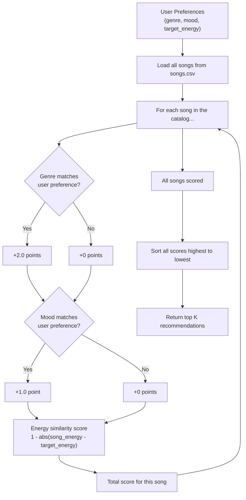

# 🎵 Music Recommender Simulation

## Project Summary

In this project you will build and explain a small music recommender system.

Your goal is to:

- Represent songs and a user "taste profile" as data
- Design a scoring rule that turns that data into recommendations
- Evaluate what your system gets right and wrong
- Reflect on how this mirrors real world AI recommenders

This project is a content-based music recommender built in Python. It loads a catalog of 18 songs from a CSV file, takes a user's preferred genre, mood, and energy level, and scores every song against those preferences using a simple weighted formula. The top 5 matches are returned with an explanation for why each one was recommended. The goal was to understand how platforms like Spotify decide what to play next — and to see where even a simple algorithm can produce results that actually feel right, and where it starts to fall apart.

---

## How The System Works

Real-world platforms like Spotify or TikTok use two main approaches to figure out what you'll want to listen to next. The first is **collaborative filtering** — basically, "people who liked what you liked also liked this, so you probably will too." It's based on patterns across users, not the music itself. The second is **content-based filtering** — it looks at the actual attributes of a song (like genre, energy level, or mood) and compares them directly to what the user prefers. Our simulation uses content-based filtering because we have song data but no real user behavior to learn from.

The way it works is pretty straightforward: for every song in the catalog, we calculate a score based on how well it matches the user's taste profile. Songs that match the genre get more points, songs that match the mood get some points, and songs that are close to the user's target energy level get a similarity bonus. Then we sort everything by score and return the top results.

**Algorithm Recipe (scoring rules):**
- +2.0 points for a genre match
- +1.0 point for a mood match
- Up to +1.0 point for energy similarity — calculated as `1 - abs(song_energy - target_energy)`, so closer = higher score

**Song features used in the simulation:**
- `genre`, `mood`, `energy`, `tempo_bpm`, `valence`, `danceability`, `acousticness`

**UserProfile features used:**
- `favorite_genre`, `favorite_mood`, `target_energy`

**Example user profile dictionary:**
```python
user_prefs = {
    "genre": "pop",
    "mood": "happy",
    "energy": 0.8
}
```

**Data flow diagram:**



**Potential biases to watch for:**
- Genre is worth 2x more than mood, so a song with a matching genre will almost always outrank one that only matches mood — even if the mood match is a better fit for the user's vibe
- The original catalog had 3 lofi songs and 2 pop songs, so those genres naturally had more chances to score well before we expanded the dataset
- Energy similarity is a small bonus (max +1.0), so it doesn't do much to separate songs once genre and mood are already matched

---

## Getting Started

### Setup

1. Create a virtual environment (optional but recommended):

   ```bash
   python -m venv .venv
   source .venv/bin/activate      # Mac or Linux
   .venv\Scripts\activate         # Windows

2. Install dependencies

```bash
pip install -r requirements.txt
```

3. Run the app:

```bash
python -m src.main
```

### Running Tests

Run the starter tests with:

```bash
pytest
```

You can add more tests in `tests/test_recommender.py`.

---

## Sample Terminal Output

Running `python -m src.main` produces results for all 5 test profiles. Here's an example from the High-Energy Pop profile (see full outputs in the Experiments section below):

```
Loaded songs: 18

==================================================
Profile: High-Energy Pop
Prefs  : {'genre': 'pop', 'mood': 'happy', 'energy': 0.85}
==================================================
1. Sunrise City by Neon Echo
   Score : 3.97
   Why   : genre match (+2.0), mood match (+1.0), energy similarity (+0.97)

2. Gym Hero by Max Pulse
   Score : 2.92
   Why   : genre match (+2.0), energy similarity (+0.92)

3. Rooftop Lights by Indigo Parade
   Score : 1.91
   Why   : mood match (+1.0), energy similarity (+0.91)

4. Storm Runner by Voltline
   Score : 0.94
   Why   : energy similarity (+0.94)

5. Night Drive Loop by Neon Echo
   Score : 0.90
   Why   : energy similarity (+0.90)
```

---

## Experiments You Tried

### Profile: High-Energy Pop

```
==================================================
Profile: High-Energy Pop
Prefs  : {'genre': 'pop', 'mood': 'happy', 'energy': 0.85}
==================================================
1. Sunrise City by Neon Echo
   Score : 3.97
   Why   : genre match (+2.0), mood match (+1.0), energy similarity (+0.97)

2. Gym Hero by Max Pulse
   Score : 2.92
   Why   : genre match (+2.0), energy similarity (+0.92)

3. Rooftop Lights by Indigo Parade
   Score : 1.91
   Why   : mood match (+1.0), energy similarity (+0.91)

4. Storm Runner by Voltline
   Score : 0.94
   Why   : energy similarity (+0.94)

5. Night Drive Loop by Neon Echo
   Score : 0.90
   Why   : energy similarity (+0.90)
```

### Profile: Chill Lofi

```
==================================================
Profile: Chill Lofi
Prefs  : {'genre': 'lofi', 'mood': 'chill', 'energy': 0.38}
==================================================
1. Library Rain by Paper Lanterns
   Score : 3.97
   Why   : genre match (+2.0), mood match (+1.0), energy similarity (+0.97)

2. Midnight Coding by LoRoom
   Score : 3.96
   Why   : genre match (+2.0), mood match (+1.0), energy similarity (+0.96)

3. Focus Flow by LoRoom
   Score : 2.98
   Why   : genre match (+2.0), energy similarity (+0.98)

4. Spacewalk Thoughts by Orbit Bloom
   Score : 1.90
   Why   : mood match (+1.0), energy similarity (+0.90)

5. Coffee Shop Stories by Slow Stereo
   Score : 0.99
   Why   : energy similarity (+0.99)
```

### Profile: Deep Intense Rock

```
==================================================
Profile: Deep Intense Rock
Prefs  : {'genre': 'rock', 'mood': 'intense', 'energy': 0.92}
==================================================
1. Storm Runner by Voltline
   Score : 3.99
   Why   : genre match (+2.0), mood match (+1.0), energy similarity (+0.99)

2. Gym Hero by Max Pulse
   Score : 1.99
   Why   : mood match (+1.0), energy similarity (+0.99)

3. Iron Will by Shatter Point
   Score : 1.95
   Why   : mood match (+1.0), energy similarity (+0.95)

4. Bass Drop Heaven by Circuit Breaker
   Score : 0.97
   Why   : energy similarity (+0.97)

5. Sunrise City by Neon Echo
   Score : 0.90
   Why   : energy similarity (+0.90)
```

### Profile: High-Energy Classical (adversarial)

```
==================================================
Profile: High-Energy Classical (adversarial)
Prefs  : {'genre': 'classical', 'mood': 'euphoric', 'energy': 0.95}
==================================================
1. Morning Mist by Clara Voss
   Score : 2.27
   Why   : genre match (+2.0), energy similarity (+0.27)

2. Bass Drop Heaven by Circuit Breaker
   Score : 2.00
   Why   : mood match (+1.0), energy similarity (+1.00)

3. Gym Hero by Max Pulse
   Score : 0.98
   Why   : energy similarity (+0.98)

4. Iron Will by Shatter Point
   Score : 0.98
   Why   : energy similarity (+0.98)

5. Storm Runner by Voltline
   Score : 0.96
   Why   : energy similarity (+0.96)
```

### Profile: Sad EDM (adversarial)

```
==================================================
Profile: Sad EDM (adversarial)
Prefs  : {'genre': 'edm', 'mood': 'sad', 'energy': 0.9}
==================================================
1. Bass Drop Heaven by Circuit Breaker
   Score : 2.95
   Why   : genre match (+2.0), energy similarity (+0.95)

2. Storm Runner by Voltline
   Score : 0.99
   Why   : energy similarity (+0.99)

3. Gym Hero by Max Pulse
   Score : 0.97
   Why   : energy similarity (+0.97)

4. Iron Will by Shatter Point
   Score : 0.93
   Why   : energy similarity (+0.93)

5. Sunrise City by Neon Echo
   Score : 0.92
   Why   : energy similarity (+0.92)
```

### Weight Shift Experiment (genre +2.0 → +1.0, energy similarity doubled)

When genre weight was halved and energy similarity doubled, middle rankings shifted noticeably. For High-Energy Pop, `Rooftop Lights` (mood match + high energy, wrong genre) climbed much closer to `Gym Hero` (genre match, wrong mood). The top spot didn't change, but the gap between 2nd and 3rd narrowed — showing that the original weights make genre act almost like a hard filter rather than one factor among several.

```
1. Sunrise City by Neon Echo    — Score: 3.94  (genre +1.0, mood +1.0, energy +1.94)
2. Gym Hero by Max Pulse        — Score: 2.84  (genre +1.0, energy +1.84)
3. Rooftop Lights by Indigo     — Score: 2.82  (mood +1.0, energy +1.82)  ← moved up
4. Storm Runner by Voltline     — Score: 1.88  (energy +1.88)
5. Night Drive Loop by Neon Echo— Score: 1.80  (energy +1.80)
```

---

## Limitations and Risks

- The catalog only has 18 songs, so genres with one track (like classical or metal) have almost no real competition — the system just defaults to energy similarity for the rest of the list
- Genre gets +2.0 points while mood only gets +1.0, so the system basically treats genre as a hard filter even when a mood match would feel more accurate
- The system doesn't understand lyrics, context, or how a song actually makes you feel — it only sees numbers and labels
- If the same artist has multiple songs in a genre, they can both show up in the top 5 even if variety would be better

See [model_card.md](model_card.md) for a deeper breakdown of bias and limitations.

---

## Reflection

Read and complete `model_card.md`:

[**Model Card**](model_card.md)

The biggest thing this project taught me is that recommender systems are less about complex AI and more about what you choose to measure and how much you weight each thing. Just picking genre, mood, and energy — and deciding genre is worth twice as much as mood — already shapes which songs "win" in ways that aren't always fair. I didn't expect such a small number change to matter so much until I actually ran the weight shift experiment and saw the rankings shift.

It also made me think differently about bias. The system isn't biased because it's broken — it's biased because of choices that seemed reasonable at design time, like giving genre more weight. That's the same thing that happens in real products, just at a much bigger scale. See [model_card.md](model_card.md) for the full reflection and documentation.


