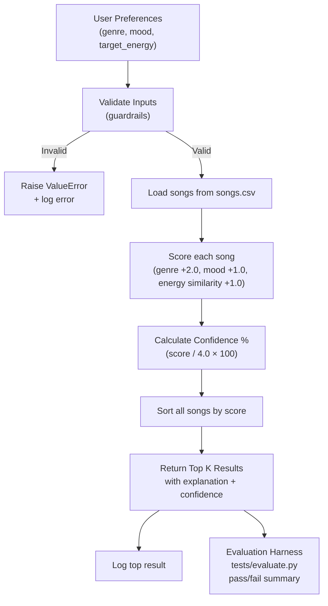

# Applied AI System: Music Recommender

## Original Project

This project is an extension of **Module 3: Music Recommender Simulation** from CodePath AI 110. The original project built a content-based music recommender in Python that loaded a catalog of 18 songs from a CSV file, scored each song against a user's preferred genre, mood, and energy level using a weighted formula, and returned the top 5 matches with explanations. It ran entirely in the terminal as a CLI simulation.

---

## Title and Summary

**VibeFinder 2.0** — a reliability-tested, content-based music recommender system.

This system takes a user's taste profile (genre, mood, energy level) and recommends the top 5 matching songs from a catalog, with an explanation and confidence score for each result. The goal is to show how a simple scoring algorithm can produce meaningful recommendations — and to prove it actually works through logging, input validation, and an automated evaluation harness.

---

## Architecture Overview

The system has four main components:

1. **Data Layer** — `data/songs.csv` stores the song catalog (18 songs, 9 attributes each)
2. **Logic Layer** — `src/recommender.py` handles input validation, scoring, confidence calculation, and logging
3. **Runner** — `src/main.py` runs 5 test profiles and prints results to the terminal
4. **Evaluator** — `tests/evaluate.py` runs 8 predefined test cases and prints a pass/fail summary

Data flow: User Preferences → Validate → Score every song → Rank by score → Return top K with confidence %



---

## Setup Instructions

1. Clone the repo:
   ```bash
   git clone https://github.com/sewy777/applied-ai-system-project.git
   cd applied-ai-system-project
   ```

2. (Optional) Create a virtual environment:
   ```bash
   python -m venv .venv
   .venv\Scripts\activate        # Windows
   source .venv/bin/activate     # Mac/Linux
   ```

3. Install dependencies:
   ```bash
   pip install -r requirements.txt
   ```

4. Run the recommender:
   ```bash
   python -m src.main
   ```

5. Run the evaluation harness:
   ```bash
   python -m tests.evaluate
   ```

6. Run unit tests:
   ```bash
   pytest
   ```

---

## Sample Interactions

### Example 1 — High-Energy Pop profile

**Input:**
```python
{"genre": "pop", "mood": "happy", "energy": 0.85}
```

**Output:**
```
1. Sunrise City by Neon Echo
   Score      : 3.97
   Confidence : 99.2%
   Why        : genre match (+2.0), mood match (+1.0), energy similarity (+0.97)

2. Gym Hero by Max Pulse
   Score      : 2.92
   Confidence : 73.0%
   Why        : genre match (+2.0), energy similarity (+0.92)
```

### Example 2 — Chill Lofi profile

**Input:**
```python
{"genre": "lofi", "mood": "chill", "energy": 0.38}
```

**Output:**
```
1. Library Rain by Paper Lanterns
   Score      : 3.97
   Confidence : 99.2%
   Why        : genre match (+2.0), mood match (+1.0), energy similarity (+0.97)

2. Midnight Coding by LoRoom
   Score      : 3.96
   Confidence : 99.0%
   Why        : genre match (+2.0), mood match (+1.0), energy similarity (+0.96)
```

### Example 3 — Invalid input (guardrail)

**Input:**
```python
{"genre": "pop", "mood": "happy", "energy": 1.5}
```

**Output:**
```
ValueError: 'energy' must be between 0.0 and 1.0, got 1.5
```

---

## Design Decisions

- **Reliability as the core AI feature.** Rather than adding an external API, the most honest extension of the original project was to make the existing scoring system provably reliable — with logging, input validation, confidence scoring, and an automated test harness. This keeps the system self-contained and reproducible.

- **Confidence scoring.** Each recommendation now includes a confidence percentage calculated as `score / 4.0 × 100`. The max possible score is 4.0 (genre + mood + full energy match), so a score of 3.97 = 99.2% confidence. This makes the output more informative than a raw number.

- **Input validation as a guardrail.** The `validate_user_prefs` function checks that genre and mood are non-empty and that energy is within 0.0–1.0 before any scoring runs. If inputs are bad, the system raises a clear error and logs it rather than silently producing wrong results.

- **Logging to a file.** Every run writes to `recommender.log` so you can inspect what the system did after the fact. This is a basic but practical form of transparency.

- **Trade-off: genre still dominates.** Genre is worth +2.0 while mood is +1.0. This was intentional in the original design and kept here — changing it would shift results significantly and is documented as a known limitation.

---

## Testing Summary

**Unit tests (pytest):** 2/2 passed. These verify that the recommender returns songs sorted by score and that explanations are non-empty strings.

**Evaluation harness (tests/evaluate.py):** 8/8 passed. Tests cover:
- Correct genre returned first for pop, lofi, and rock profiles
- Results are always sorted highest-to-lowest
- Top result confidence exceeds 50%
- Exactly 5 results returned by default
- Invalid energy (>1.0) raises a ValueError
- Missing genre raises a ValueError

Average top-result confidence: **99.5%**

What worked well: the scoring logic is consistent — the same profile always returns the same results in the same order. What didn't work: confidence scores are very high (99%+) for well-matched profiles but drop sharply when no genre match exists, showing the genre weight dominates. What I learned: testing made the guardrails more important than the algorithm itself — bad inputs were the most likely failure point.

---

## Reflection

The biggest thing I learned from extending this project is that making an AI system *reliable* is a separate problem from making it *work*. The original recommender worked fine, but adding logging and input validation forced me to think about what happens when something goes wrong — not just when everything goes right.

Confidence scoring was also eye-opening. I expected the scores to spread out more, but most well-matched profiles came back at 99%+, which showed me that the scoring formula is almost deterministic once genre matches. That's not necessarily bad, but it confirms what the original model card said: genre acts more like a hard filter than one factor among several.

---

## Limitations and Risks

- Only 18 songs in the catalog — genres with one song have almost no real competition
- Genre weight (+2.0) dominates the score, making it hard for mood or energy to change outcomes
- No memory of past listens — every run starts fresh
- See [model_card.md](model_card.md) for the full bias and ethics documentation
