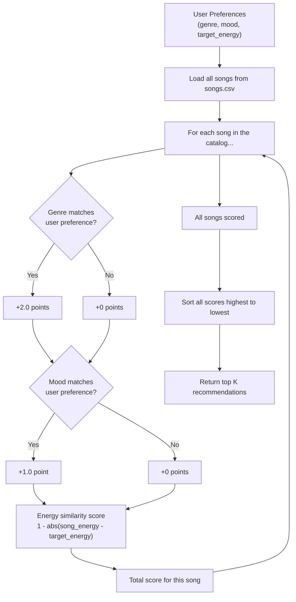

# 🎵 Music Recommender Simulation

## Project Summary

In this project you will build and explain a small music recommender system.

Your goal is to:

- Represent songs and a user "taste profile" as data
- Design a scoring rule that turns that data into recommendations
- Evaluate what your system gets right and wrong
- Reflect on how this mirrors real world AI recommenders

Replace this paragraph with your own summary of what your version does.

---

## How The System Works

Real-world platforms like Spotify or TikTok use two main approaches to figure out what you'll want to listen to next. The first is **collaborative filtering** — basically, "people who liked what you liked also liked this, so you probably will too." It's based on patterns across users, not the music itself. The second is **content-based filtering** — it looks at the actual attributes of a song (like genre, energy level, or mood) and compares them directly to what the user prefers. Our simulation uses content-based filtering because we have song data but no real user behavior to learn from.

The way it works is pretty straightforward: for every song in the catalog, we calculate a score based on how well it matches the user's taste profile. Songs that match the genre get more points, songs that match the mood get some points, and songs that are close to the user's target energy level get a similarity bonus. Then we sort everything by score and return the top results.

**Algorithm Recipe (scoring rules):**
- +2.0 points for a genre match
- +1.0 point for a mood match
- Up to +1.0 point for energy similarity — calculated as `1 - abs(song_energy - target_energy)`, so closer = higher score

**Song features used in the simulation:**
- `genre`, `mood`, `energy`, `tempo_bpm`, `valence`, `danceability`, `acousticness`

**UserProfile features used:**
- `favorite_genre`, `favorite_mood`, `target_energy`

**Example user profile dictionary:**
```python
user_prefs = {
    "genre": "pop",
    "mood": "happy",
    "energy": 0.8
}
```

**Data flow diagram:**



**Potential biases to watch for:**
- Genre is worth 2x more than mood, so a song with a matching genre will almost always outrank one that only matches mood — even if the mood match is a better fit for the user's vibe
- The original catalog had 3 lofi songs and 2 pop songs, so those genres naturally had more chances to score well before we expanded the dataset
- Energy similarity is a small bonus (max +1.0), so it doesn't do much to separate songs once genre and mood are already matched

---

## Getting Started

### Setup

1. Create a virtual environment (optional but recommended):

   ```bash
   python -m venv .venv
   source .venv/bin/activate      # Mac or Linux
   .venv\Scripts\activate         # Windows

2. Install dependencies

```bash
pip install -r requirements.txt
```

3. Run the app:

```bash
python -m src.main
```

### Running Tests

Run the starter tests with:

```bash
pytest
```

You can add more tests in `tests/test_recommender.py`.

---

## Sample Terminal Output

Running `python -m src.main` with the default pop/happy profile (energy: 0.8):

```
Loaded songs: 18

Top recommendations:

--------------------------------------------------
1. Sunrise City by Neon Echo
   Score : 3.98
   Why   : genre match (+2.0), mood match (+1.0), energy similarity (+0.98)

2. Gym Hero by Max Pulse
   Score : 2.87
   Why   : genre match (+2.0), energy similarity (+0.87)

3. Rooftop Lights by Indigo Parade
   Score : 1.96
   Why   : mood match (+1.0), energy similarity (+0.96)

4. Night Drive Loop by Neon Echo
   Score : 0.95
   Why   : energy similarity (+0.95)

5. Neighborhood Kid by Block Theory
   Score : 0.92
   Why   : energy similarity (+0.92)
```

---

## Experiments You Tried

Use this section to document the experiments you ran. For example:

- What happened when you changed the weight on genre from 2.0 to 0.5
- What happened when you added tempo or valence to the score
- How did your system behave for different types of users

---

## Limitations and Risks

Summarize some limitations of your recommender.

Examples:

- It only works on a tiny catalog
- It does not understand lyrics or language
- It might over favor one genre or mood

You will go deeper on this in your model card.

---

## Reflection

Read and complete `model_card.md`:

[**Model Card**](model_card.md)

Write 1 to 2 paragraphs here about what you learned:

- about how recommenders turn data into predictions
- about where bias or unfairness could show up in systems like this


---

## 7. `model_card_template.md`

Combines reflection and model card framing from the Module 3 guidance. :contentReference[oaicite:2]{index=2}  

```markdown
# 🎧 Model Card - Music Recommender Simulation

## 1. Model Name

Give your recommender a name, for example:

> VibeFinder 1.0

---

## 2. Intended Use

- What is this system trying to do
- Who is it for

Example:

> This model suggests 3 to 5 songs from a small catalog based on a user's preferred genre, mood, and energy level. It is for classroom exploration only, not for real users.

---

## 3. How It Works (Short Explanation)

Describe your scoring logic in plain language.

- What features of each song does it consider
- What information about the user does it use
- How does it turn those into a number

Try to avoid code in this section, treat it like an explanation to a non programmer.

---

## 4. Data

Describe your dataset.

- How many songs are in `data/songs.csv`
- Did you add or remove any songs
- What kinds of genres or moods are represented
- Whose taste does this data mostly reflect

---

## 5. Strengths

Where does your recommender work well

You can think about:
- Situations where the top results "felt right"
- Particular user profiles it served well
- Simplicity or transparency benefits

---

## 6. Limitations and Bias

Where does your recommender struggle

Some prompts:
- Does it ignore some genres or moods
- Does it treat all users as if they have the same taste shape
- Is it biased toward high energy or one genre by default
- How could this be unfair if used in a real product

---

## 7. Evaluation

How did you check your system

Examples:
- You tried multiple user profiles and wrote down whether the results matched your expectations
- You compared your simulation to what a real app like Spotify or YouTube tends to recommend
- You wrote tests for your scoring logic

You do not need a numeric metric, but if you used one, explain what it measures.

---

## 8. Future Work

If you had more time, how would you improve this recommender

Examples:

- Add support for multiple users and "group vibe" recommendations
- Balance diversity of songs instead of always picking the closest match
- Use more features, like tempo ranges or lyric themes

---

## 9. Personal Reflection

A few sentences about what you learned:

- What surprised you about how your system behaved
- How did building this change how you think about real music recommenders
- Where do you think human judgment still matters, even if the model seems "smart"

